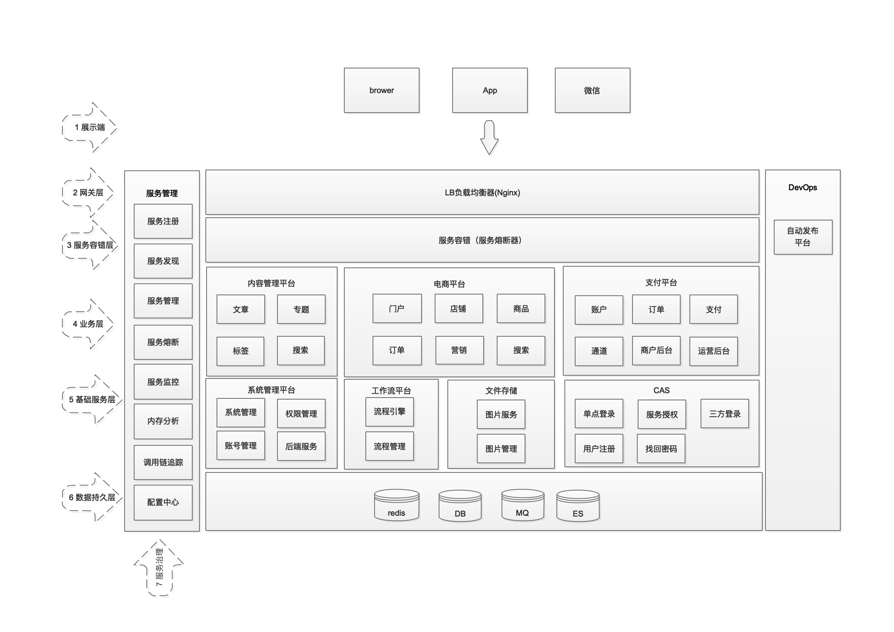

jbone是基于Spring Cloud开发的项目群

**功能架构图**

**项目成员**

项目名 | 简介 | 项目地址
---- | ------ | ----
jbone-sso | 单点登录模块 | [github](https://github.com/417511458/jbone-sso) , [码云](https://gitee.com/majunwei2017/jbone-sso)
jbone-service-management | 服务管理模块(包含注册中心、服务网关、服务监控、调用链追踪等)  |  [github](https://github.com/417511458/jbone-service-management) , [码云](https://gitee.com/majunwei2017/jbone-service-management)
jbone-system | 系统管理模块,通用权限管理等 | [github](https://github.com/417511458/jbone-system) , [码云](https://gitee.com/majunwei2017/jbone-system)
jbone-fs | 文件系统，用于存储和管理文件、图片等 | [github](https://github.com/417511458/jbone-fs) , [码云](https://gitee.com/majunwei2017/jbone-fs)
jbone-cms | 多站点内容管理系统 | [github](https://github.com/417511458/jbone-cms) , [码云](https://gitee.com/majunwei2017/jbone-cms)
jbone-common | 公共模块，封装工具类等 | [github](https://github.com/417511458/jbone) , [码云](https://gitee.com/majunwei2017/jbone)
jbone-banner | jbone通用艺术banner | [github](https://github.com/417511458/jbone) , [码云](https://gitee.com/majunwei2017/jbone)
jbone-configuration | 公共配置模块 | [github](https://github.com/417511458/jbone) , [码云](https://gitee.com/majunwei2017/jbone)
jbone-ui | 以webjars形式管理前端静态资源，所有包含页面的工程需要依赖此模块。 | [github](https://github.com/417511458/jbone) , [码云](https://gitee.com/majunwei2017/jbone)
jbone-b2b2c | 多店铺电商平台 (未完成) | [github](https://github.com/417511458/jbone-b2b2c) , [码云](https://gitee.com/majunwei2017/jbone-b2b2c)
jbone-bpm | 工作流模块(未完成) | [github](https://github.com/417511458/jbone-bpm) , [码云](https://gitee.com/majunwei2017/jbone-bpm)
